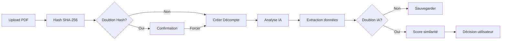

# 📋 Module Décomptes Mutuelles v2.1.0

> **Système complet de gestion des décomptes mutuelles avec analyse IA et détection de doublons multicouches**

[](https://firebase.google.com/)
[](https://mozilla.github.io/pdf.js/)
[](https://openai.com/)
[](https://github.com/)

---

## 📑 Table des matières

1. [Installation](#-installation)
2. [Architecture](#-architecture)
3. [Fonctionnalités](#-fonctionnalités)
4. [Configuration](#-configuration)
5. [Structure des données](#-structure-des-données)
6. [API & Services](#-api--services)
7. [Workflows](#-workflows)
8. [Détection de doublons](#-détection-de-doublons)
9. [Troubleshooting](#-troubleshooting)
10. [Développement](#-développement)

---

## 🚀 Installation

### Prérequis

- Firebase Project avec Firestore & Storage activés
- Cloud Function `analyzeDocument` déployée
- Authentification configurée

### 1️⃣ Configuration Firebase

#### Collections Firestore requises

```javascript
decomptesMutuelles   // Collection principale des décomptes
magasins             // Référentiel des magasins (FINESS, codes, adresses)
```

#### Règles de sécurité Firestore

```javascript
rules_version = '2';
service cloud.firestore {
  match /databases/{database}/documents {
    // Lecture/écriture authentifiée
    match /decomptesMutuelles/{document=**} {
      allow read, write: if request.auth != null;
    }
    
    // Magasins en lecture seule
    match /magasins/{document=**} {
      allow read: if request.auth != null;
      allow write: if request.auth != null && 
        request.auth.token.role == 'admin';
    }
  }
}
```

#### Configuration Storage

```javascript
rules_version = '2';
service firebase.storage {
  match /b/{bucket}/o {
    match /decomptes-mutuelles/{allPaths=**} {
      allow read: if request.auth != null;
      allow write: if request.auth != null && 
        request.resource.size < 10 * 1024 * 1024; // Max 10MB
    }
  }
}
```

### 2️⃣ Dépendances HTML

```html
<!DOCTYPE html>
<html lang="fr">
<head>
    <!-- CSS Principal -->
    <link rel="stylesheet" href="../../src/css/main.css">
    
    <!-- PDF.js pour conversion PDF → Images -->
    <script src="https://cdnjs.cloudflare.com/ajax/libs/pdf.js/3.11.174/pdf.min.js"></script>
    <script>
        pdfjsLib.GlobalWorkerOptions.workerSrc = 
          'https://cdnjs.cloudflare.com/ajax/libs/pdf.js/3.11.174/pdf.worker.min.js';
    </script>
</head>
```

### 3️⃣ Structure des fichiers

```
/modules/decompte-mutuelle/
├── 📄 decompte-mutuelle.html                 # Page principale
├── 🎯 decompte-mutuelle.orchestrator.js      # Orchestrateur principal
├── 🔥 decompte-mutuelle.firestore.service.js # Service Firestore CRUD
├── 📁 decompte-mutuelle.upload.service.js    # Service upload Storage
├── 🤖 decompte-mutuelle.openai.service.js    # Service analyse IA
├── 📋 decompte-mutuelle.template.js          # Template structure Firestore
├── 🛠️ decompte-mutuelle.service.js          # Service unifié (optionnel)
└── 📖 README.md                               # Documentation
```

---

## 🏗️ Architecture

### Flux de données



### Services principaux

| Service | Responsabilité | Fichier |
|---------|---------------|---------|
| **Orchestrator** | Coordination, logique métier | `orchestrator.js` |
| **Firestore** | CRUD, recherche, statistiques | `firestore.service.js` |
| **Upload** | Storage, hash, métadonnées | `upload.service.js` |
| **OpenAI** | Analyse IA, extraction données | `openai.service.js` |
| **Template** | Structure données, validation | `template.js` |

---

## ✨ Fonctionnalités

### 🔍 Détection de doublons 3 niveaux

#### Niveau 1 : Hash SHA-256
- ✅ Calcul avant upload
- ✅ Comparaison instantanée
- ✅ Blocage si 100% identique

#### Niveau 2 : Analyse intelligente post-IA
- ✅ Comparaison multi-critères
- ✅ Score de similarité (40-100%)
- ✅ Prise en compte des montants

#### Niveau 3 : Support décomptes groupés
- ✅ Recherche dans `clients[]`
- ✅ Détection partielle (1 client sur N)
- ✅ Agrégation des scores

### 📊 Types de décomptes

| Type | Description | Champs spécifiques |
|------|-------------|-------------------|
| **Individuel** | 1 seul client | `client`, `montantRemboursementClient` |
| **Groupe** | Plusieurs clients | `clients[]`, `nombreClients`, `montantVirement` |

### 🤖 Analyse IA

- **Modèle** : GPT-4 Vision (via Cloud Function)
- **Extraction** : Client, NSS, montants, mutuelle, FINESS
- **Conversion** : PDF → Images (max 5 pages)
- **Recherche FINESS** : Mapping automatique code magasin

### 📈 Workflow des statuts

```
📋 Nouveau ──► 🤖 Traitement IA ──► ✅ Traité ──► 🔗 Rapproché
                      │
                      ▼
                 ✏️ Manuel ─────────► 🔗 Rapproché
```

---

## ⚙️ Configuration

### Variables globales

```javascript
// decompte-mutuelle.firestore.service.js
const CONFIG = {
    // Firestore
    COLLECTION_NAME: 'decomptesMutuelles',
    
    // Storage
    STORAGE_BASE_PATH: 'decomptes-mutuelles',
    MAX_FILE_SIZE: 10 * 1024 * 1024,  // 10MB
    ALLOWED_TYPES: [
        'application/pdf',
        'image/jpeg',
        'image/png'
    ],
    
    // Cloud Function IA
    CLOUD_FUNCTION_URL: 'https://europe-west1-orixis-pwa.cloudfunctions.net/analyzeDocument',
    
    // Statuts
    STATUTS: {
        NOUVEAU: 'nouveau',
        TRAITEMENT_IA: 'traitement_ia',
        TRAITEMENT_EFFECTUE: 'traitement_effectue',
        TRAITEMENT_MANUEL: 'traitement_manuel',
        RAPPROCHEMENT_BANCAIRE: 'rapprochement_bancaire',
        SUPPRIME: 'supprime'
    }
};
```

### Structure Storage

```
decomptes-mutuelles/
├── [SOCIÉTÉ]/
│   └── inbox/
│       └── [ANNÉE]/
│           └── [MOIS]/
│               └── [JOUR]/
│                   └── DM_[SOCIÉTÉ]_[DATE]_[HEURE]_[UUID].pdf
```

Exemple : `decomptes-mutuelles/ORIXIS/inbox/2025/02/08/DM_ORIXIS_20250208_143029_A3F5B8C9.pdf`

---

## 📁 Structure des données

### Document Firestore complet

```javascript
{
    // === IDENTIFICATION ===
    numeroDecompte: "DEC-20250208-0001",        // Format unique
    typeDecompte: "individuel",                 // ou "groupe"
    
    // === ORGANISATION ===
    societe: "ORIXIS SAS",                      // Destinataire
    codeMagasin: "9PAR",                        // Code magasin
    magasinUploadeur: "9PAR",                   // Qui a uploadé
    prestataireTP: "SANTECLAIR",                // Réseau de soins
    
    // === CLIENT UNIQUE (si individuel) ===
    client: {
        id: null,
        nom: "DUPONT",
        prenom: "Jean",
        numeroSecuriteSociale: "1850578006048",
        numeroAdherent: "A123456"
    },
    
    // === CLIENTS MULTIPLES (si groupe) ===
    clients: [
        {
            nom: "DUPONT",
            prenom: "Jean",
            numeroSecuriteSociale: "1850578006048",
            numeroAdherent: "A123456",
            montantRemboursement: 150.50,
            typeVirement: "individuel"
        },
        // ... autres clients
    ],
    nombreClients: 3,                           // Nombre total
    
    // === DONNÉES FINANCIÈRES ===
    mutuelle: "VIAMEDIS",                       // Organisme payeur
    montantRemboursementClient: 150.50,         // Si individuel
    montantVirement: 450.00,                    // Total virement
    dateVirement: Timestamp,                    // Date du virement
    virementId: "VIR-2025-02-001",             // Référence
    
    // === DOCUMENTS ===
    documents: [
        {
            nom: "DM_ORIXIS_20250208_143029_A3F5B8C9.pdf",
            nomOriginal: "decompte-janvier.pdf",
            chemin: "decomptes-mutuelles/ORIXIS/inbox/2025/02/08/...",
            url: "https://storage.googleapis.com/...",
            taille: 245687,
            type: "application/pdf",
            hash: "e40007f2408642a1b3d4c5e6f7a8b9c0...",  // SHA-256
            dateUpload: Timestamp
        }
    ],
    
    // === WORKFLOW ===
    statut: "nouveau",
    dates: {
        creation: Timestamp,
        transmissionIA: null,
        traitementEffectue: null,
        traitementManuel: null,
        rapprochementBancaire: null
    },
    
    // === INTERVENANTS ===
    intervenants: {
        creePar: {
            id: "user-123",
            nom: "MARTIN",
            prenom: "Sophie",
            role: "technicien"
        },
        traitePar: null,
        rapprochePar: null
    },
    
    // === HISTORIQUE ===
    historique: [
        {
            date: Timestamp,
            action: "creation",
            details: "1 document(s) uploadé(s)",
            timestamp: 1707398429000,
            utilisateur: { /* ... */ }
        }
    ],
    
    // === EXTRACTION IA ===
    extractionIA: {
        timestamp: "2025-02-08T14:30:29",
        modele: "gpt-4.1-mini",
        societeDetectee: "ORIXIS AUDITION PARIS",
        periode: "2025-01",
        donneesBrutes: { /* JSON brut de l'IA */ }
    }
}
```

---

## 🔌 API & Services

### Service Principal : DecompteFirestoreService

```javascript
import firestoreService from './decompte-mutuelle.firestore.service.js';

// === CRUD ===
const id = await firestoreService.creerDecompte({ documents: [...] });
const decomptes = await firestoreService.getDecomptes({ limite: 50 });
const decompte = await firestoreService.getDecompteById(id);
await firestoreService.updateDecompte(id, updates);
await firestoreService.supprimerDecompte(id, { motif: "..." });

// === WORKFLOW ===
await firestoreService.changerStatut(id, 'traitement_ia');

// === DOUBLONS ===
const doublon = await firestoreService.verifierHashExiste(hash);
const doublons = await firestoreService.rechercherDoublonsProbables({
    client: { nom: "DUPONT", prenom: "Jean" },
    montantVirement: 150.50,
    mutuelle: "VIAMEDIS"
});

// === STATISTIQUES ===
const stats = await firestoreService.getStatistiques();
```

### Service Upload

```javascript
import uploadService from './decompte-mutuelle.upload.service.js';

// Upload multiple
const resultats = await uploadService.uploadDocuments(files);
// resultats = { reussis: [...], erreurs: [...] }

// Hash SHA-256
const hash = await uploadService.calculateFileHash(file);

// Suppression
await uploadService.deleteDocument(chemin);
```

### Service IA

```javascript
import openaiService from './decompte-mutuelle.openai.service.js';

// Analyse avec fichier direct (recommandé - évite CORS)
const donnees = await openaiService.analyserAvecFichier(file, magasins);

// Conversion PDF → Images
const images = await openaiService.convertirFichierEnImages(file);
```

---

## 🔄 Workflows

### Workflow complet d'upload

```javascript
// 1. Upload des fichiers
const files = event.target.files;

// 2. Pour chaque fichier
for (const file of files) {
    // 3. Calcul du hash
    const hash = await uploadService.calculateFileHash(file);
    
    // 4. Vérification doublon hash
    const doublonHash = await firestoreService.verifierHashExiste(hash);
    if (doublonHash) {
        if (!confirm("Fichier déjà existant. Continuer ?")) continue;
    }
    
    // 5. Upload Storage
    const upload = await uploadService.uploadDocuments([file]);
    
    // 6. Création décompte
    const decompteId = await firestoreService.creerDecompte({
        documents: upload.reussis
    });
    
    // 7. Analyse IA
    const donneesIA = await openaiService.analyserAvecFichier(file, magasins);
    
    // 8. Vérification doublon intelligent
    const doublonsIA = await firestoreService.rechercherDoublonsProbables(donneesIA);
    if (doublonsIA.length > 0 && doublonsIA[0].score >= 60) {
        const garder = confirm(`Doublon probable détecté (${doublonsIA[0].score}%). Garder ?`);
        if (!garder) {
            await firestoreService.supprimerDecompte(decompteId);
            continue;
        }
    }
    
    // 9. Sauvegarde données IA
    await firestoreService.ajouterDonneesExtraites(decompteId, donneesIA);
}
```

---

## 🔍 Détection de doublons

### Niveaux et seuils

| Niveau | Méthode | Seuil | Action |
|--------|---------|-------|--------|
| **Hash** | SHA-256 identique | 100% | Blocage avec confirmation |
| **Client** | Nom + Prénom identiques | 40% base | Score cumulatif |
| **Montant** | Différence < 0.01€ | +30% | Ajout au score |
| **Mutuelle** | Nom identique | +20% | Ajout au score |
| **Magasin** | Code identique | +10% | Ajout au score |

### Interprétation des scores

- 🟢 **< 40%** : Pas de doublon
- 🟡 **40-60%** : Doublon possible
- 🟠 **60-80%** : Doublon probable
- 🔴 **80-100%** : Doublon quasi-certain

### Gestion des décomptes groupés

```javascript
// Recherche dans un décompte groupé
if (decompte.clients && Array.isArray(decompte.clients)) {
    for (const client of decompte.clients) {
        if (client.nom === recherche.nom && 
            client.prenom === recherche.prenom) {
            // Client trouvé dans le groupe
            score = 100; // pour ce client spécifique
        }
    }
}
```

---

## 🚨 Troubleshooting

### Erreurs courantes

#### 1. "Missing or insufficient permissions"

**Cause** : Règles Firestore restrictives

**Solution** :
```javascript
// Temporaire pour tests
match /{document=**} {
  allow read, write: if true;
}
```

#### 2. "PDF.js is not loaded"

**Cause** : Script PDF.js manquant

**Solution** : Ajouter dans le HTML
```html
<script src="https://cdnjs.cloudflare.com/ajax/libs/pdf.js/3.11.174/pdf.min.js"></script>
```

#### 3. "CORS error on document fetch"

**Cause** : Tentative de fetch direct sur Storage URL

**Solution** : Utiliser `analyserAvecFichier()` au lieu de `analyserDocument()`

#### 4. "Hash already exists but not detected"

**Cause** : Format du hash incorrect

**Solution** : Vérifier que le hash est en hexadécimal lowercase

#### 5. "Magasin not found for FINESS"

**Cause** : Collection magasins incomplète

**Solution** : Charger les magasins au démarrage
```javascript
await firestoreService.chargerMagasins();
```

### Logs de debug

```javascript
// Activer les logs détaillés
localStorage.setItem('DEBUG_DECOMPTES', 'true');

// Vérifier l'état
console.log('Auth:', localStorage.getItem('sav_auth'));
console.log('Magasins:', localStorage.getItem('orixis_magasins'));

// Tester la connexion
const test = await firestoreService.getDecomptes({ limite: 1 });
console.log('Test Firestore:', test);

// Vérifier les permissions
const user = firebase.auth().currentUser;
console.log('User:', user);
```

---

## 👨‍💻 Développement

### Tests unitaires

```javascript
// Test hash
const file = new File(['test'], 'test.txt');
const hash = await uploadService.calculateFileHash(file);
console.assert(hash.length === 64, 'Hash SHA-256 invalide');

// Test NSS
const nssValide = firestoreService.validerNSS('1850578006048');
console.assert(nssValide === true, 'Validation NSS échouée');

// Test formatage
const montant = firestoreService.formaterMontant(150.50);
console.assert(montant === '150,50 €', 'Formatage montant incorrect');
```

### Ajout d'un nouveau statut

1. Ajouter dans `CONFIG.STATUTS`
2. Ajouter dans `CONFIG.STATUTS_INFO`
3. Mettre à jour le workflow dans `changerStatut()`
4. Ajouter la carte dans l'orchestrateur

### Modification du prompt IA

Fichier : `decompte-mutuelle.openai.service.js`
```javascript
const prompt = `Tu es un expert...
// Modifier ici le prompt
`;
```

### Performance

- **Cache magasins** : localStorage pour éviter requêtes répétées
- **Lazy loading** : Charger les décomptes par batch de 50
- **Debounce recherche** : 300ms de délai
- **Index Firestore** : Sur `statut`, `dates.creation`, `societe`

---

## 📝 Changelog

### v2.1.0 (08/02/2025)
- ✅ Détection doublons 3 niveaux
- ✅ Support décomptes groupés
- ✅ Analyse directe des fichiers (évite CORS)
- ✅ Score de similarité détaillé
- ✅ Documentation complète

### v2.0.0 (07/02/2025)
- ✅ Refonte complète architecture
- ✅ Service unifié
- ✅ Hash SHA-256
- ✅ Workflow complet

### v1.0.0 (06/02/2025)
- ✅ Version initiale
- ✅ Upload basique
- ✅ Analyse IA simple

---

## 📄 License

Propriétaire - ORIXIS SAS © 2025

---

## 🤝 Support

- **Email** : support@orixis.fr
- **Documentation** : `/docs/decomptes-mutuelles`
- **Slack** : #team-decomptes

---

*Dernière mise à jour : 08/02/2025 - Module Décomptes Team*