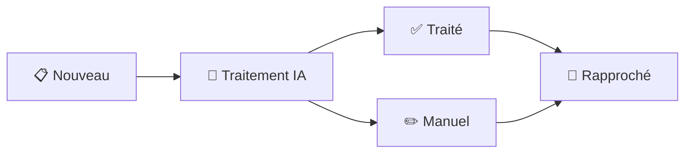

# 📄 Module Décomptes Mutuelles

Module complet de gestion des décomptes mutuelles avec analyse IA automatique et workflow intégré.

## 🏗️ Architecture Simplifiée

```
/modules/decompte-mutuelle/
├── decompte-mutuelle.html              # Page HTML
├── decompte-mutuelle.css               # Styles spécifiques
├── decompte-mutuelle.orchestrator.js   # Orchestrateur des widgets
├── decompte-mutuelle.service.js        # Service backend unifié
└── decompte-mutuelle.template.js       # Template Firestore
```

## 🚀 Installation

### Prérequis

- ✅ Firebase configuré (Auth, Firestore, Storage)
- ✅ Cloud Function déployée pour l'analyse IA
- ✅ Widgets installés dans `/widgets/`
- ✅ Utilisateur authentifié

### Configuration Firebase

```javascript
// Collections Firestore requises
- decomptes_mutuelles  // Collection principale
- magasins            // Pour la recherche FINESS

// Structure Storage
decomptes-mutuelles/
└── [société]/
    └── inbox/
        └── [année]/
            └── [mois]/
                └── [jour]/
                    └── [fichiers]
```

## 📦 Widgets Utilisés

| Widget | Rôle | Import |
|--------|------|--------|
| **HeaderWidget** | En-tête avec infos utilisateur | `/widgets/header/header.widget.js` |
| **StatsCardsWidget** | Cartes de statistiques cliquables | `/widgets/stats-cards/stats-cards.widget.js` |
| **SearchFiltersWidget** | Filtres de recherche avancés | `/widgets/search-filters/search-filters.widget.js` |
| **DataGridWidget** | Tableau avec tri, pagination, export | `/widgets/data-grid/data-grid.widget.js` |
| **PdfUploaderWidget** | Upload de documents avec workflow | `/widgets/pdf-uploader/pdf-uploader.widget.js` |
| **DetailViewerWidget** | Affichage détaillé avec timeline | `/widgets/detail-viewer/detail-viewer.widget.js` |

## 🔄 Workflow Complet

### 1️⃣ Création d'un décompte

```javascript
// L'utilisateur clique sur "Nouveau décompte"
// → Ouverture du PdfUploaderWidget
// → Upload des PDF
// → Création automatique dans Firestore
// → Analyse IA optionnelle

const uploader = new PdfUploaderWidget({
    title: 'Nouveau Décompte Mutuelle',
    onSave: async (data) => {
        // Upload des fichiers
        const resultats = await decompteService.uploadDocuments(data.files);
        
        // Création du décompte
        const decompteId = await decompteService.creerDecompte({
            documents: resultats.reussis
        });
        
        // Analyse IA automatique
        await decompteService.analyserDecompteIA(decompteId);
        
        // Rafraîchir la liste
        await refreshGrid();
    }
});
```

### 2️⃣ Workflow des statuts



### 3️⃣ Visualisation détaillée

```javascript
// Clic sur une ligne du tableau
// → Ouverture du DetailViewerWidget
// → Timeline du workflow
// → Actions contextuelles selon le statut

grid.onRowClick = (row) => {
    new DetailViewerWidget({
        title: `Décompte ${row.numeroDecompte}`,
        data: row,
        timeline: generateTimeline(row),
        actions: getActionsForStatus(row.statut)
    });
};
```

## 💻 API du Service

### Méthodes principales

```javascript
import decompteService from './decompte-mutuelle.service.js';

// Upload de documents
const resultats = await decompteService.uploadDocuments(files);
// → { reussis: [...], erreurs: [...] }

// Création d'un décompte
const decompteId = await decompteService.creerDecompte({
    documents: resultats.reussis
});

// Récupération des décomptes
const decomptes = await decompteService.getDecomptes({
    statut: 'nouveau',      // Filtrer par statut
    mutuelle: 'HARMONIE',   // Filtrer par mutuelle
    magasin: '9PAR',        // Filtrer par magasin
    limite: 50              // Limiter les résultats
});

// Récupération d'un décompte
const decompte = await decompteService.getDecompteById(id);

// Analyse IA
const donneesExtraites = await decompteService.analyserDecompteIA(decompteId);

// Changement de statut
await decompteService.changerStatut(decompteId, 'rapprochement_bancaire', {
    motif: 'Validation manuelle'  // Optionnel
});

// Statistiques
const stats = await decompteService.getStatistiques();
// → { total: 42, parStatut: {...}, parMutuelle: {...}, montantTotal: 12500 }

// Recherche
const resultats = await decompteService.rechercherDecomptes('DUPONT');
```

## 🎨 Structure des données

### Template Firestore

```javascript
{
    // Identification
    numeroDecompte: "DEC-20250208-0001",
    typeDecompte: "individuel",
    
    // Organisation
    societe: "ORIXIS SAS",
    codeMagasin: "9PAR",
    magasinUploadeur: "9PAR",
    prestataireTP: "SANTECLAIR",
    
    // Client
    client: {
        nom: "DUPONT",
        prenom: "Jean",
        numeroSecuriteSociale: "1850578006048"
    },
    
    // Données financières
    mutuelle: "HARMONIE",
    montantRemboursementClient: 150.50,
    montantVirement: 150.50,
    nombreClients: 1,
    dateVirement: Timestamp,
    
    // Dates
    dates: {
        creation: Timestamp,
        transmissionIA: Timestamp,
        traitementEffectue: Timestamp,
        traitementManuel: null,
        rapprochementBancaire: null
    },
    
    // Documents
    documents: [{
        nom: "DM_ORIXIS_20250208_143029_550e8400.pdf",
        url: "https://storage.googleapis.com/...",
        taille: 245687,
        type: "application/pdf"
    }],
    
    // Workflow
    statut: "traitement_effectue",
    
    // Historique
    historique: [...]
}
```

## 🤖 Analyse IA

### Données extraites automatiquement

- ✅ **Client** : Nom, prénom, NSS
- ✅ **Mutuelle** : Organisme payeur
- ✅ **Montants** : Remboursement, virement
- ✅ **Dates** : Virement, période
- ✅ **Magasin** : Via numéro FINESS
- ✅ **Type** : Individuel ou groupé

### Prompt IA personnalisable

Le prompt est dans `decompteService.buildOpenAIPrompt()` et peut être adapté selon vos besoins.

## 📊 Statistiques disponibles

```javascript
const stats = await decompteService.getStatistiques();

// Retourne :
{
    total: 156,                    // Nombre total de décomptes
    parStatut: {
        nouveau: 12,
        traitement_ia: 3,
        traitement_effectue: 85,
        rapprochement_bancaire: 56
    },
    parMutuelle: {
        HARMONIE: 45,
        SANTECLAIR: 38,
        ALMERYS: 73
    },
    montantTotal: 24650.50,        // Somme totale des virements
    montantMoyen: 158.01           // Montant moyen par décompte
}
```

## 🔍 Recherche et filtres

### Filtres disponibles

- **Recherche textuelle** : Client, NSS, n° décompte, virement
- **Magasin** : Code magasin
- **Mutuelle** : Organisme mutuelle
- **Réseau TP** : Prestataire tiers-payant
- **Période** : Toutes, aujourd'hui, semaine, mois
- **Statut** : Filtrage par statut ou multi-statuts

### Export des données

```javascript
// Export CSV ou Excel via DataGridWidget
grid.export('csv');   // Export CSV
grid.export('excel'); // Export Excel
```

## ⚙️ Configuration

### Constantes modifiables

```javascript
// Dans decompte-mutuelle.service.js
const CONFIG = {
    MAX_FILE_SIZE: 10 * 1024 * 1024,  // 10MB
    ALLOWED_TYPES: ['application/pdf', 'image/jpeg', 'image/png'],
    CLOUD_FUNCTION_URL: 'https://...',
    // ...
};
```

### Personnalisation des widgets

```javascript
// Couleurs des statuts (StatsCardsWidget)
const statsCards = new StatsCardsWidget({
    cards: [
        { statut: 'nouveau', color: 'secondary' },
        { statut: 'traitement_ia', color: 'info' },
        { statut: 'traitement_effectue', color: 'success' }
    ]
});

// Colonnes du tableau (DataGridWidget)
const grid = new DataGridWidget({
    columns: [
        { key: 'dateVirement', label: 'Date', sortable: true },
        { key: 'client', label: 'Client', formatter: formatClient },
        // ...
    ]
});
```

## 🚨 Gestion des erreurs

```javascript
try {
    const decompteId = await decompteService.creerDecompte(data);
} catch (error) {
    if (error.message.includes('trop volumineux')) {
        alert('Fichier trop volumineux (max 10MB)');
    } else if (error.message.includes('Type de fichier')) {
        alert('Seuls les PDF et images sont acceptés');
    } else {
        console.error('Erreur création:', error);
        alert('Erreur lors de la création du décompte');
    }
}
```

## 📱 Responsive

Le module s'adapte automatiquement :

- **Desktop** : Layout multi-colonnes, modals centrés
- **Tablet** : Colonnes adaptatives, modals pleine largeur
- **Mobile** : Layout vertical, modals plein écran

## 🔐 Sécurité

- ✅ Authentification requise
- ✅ Validation des fichiers (type, taille)
- ✅ Hash SHA-256 pour détecter les doublons
- ✅ Traçabilité complète (historique)
- ✅ Permissions par rôle (à implémenter)

## 🐛 Debug

```javascript
// Activer les logs détaillés
localStorage.setItem('debug_decomptes', 'true');

// Vérifier l'état du service
console.log(decompteService.getUserInfo());
console.log(await decompteService.getStatistiques());

// Tester l'upload
const testFile = new File(['test'], 'test.pdf', { type: 'application/pdf' });
const result = await decompteService.uploadDocuments([testFile]);
console.log('Upload result:', result);
```

## 📈 Performances

- **Pagination** : Chargement par pages de 20-50 items
- **Lazy loading** : Widgets chargés à la demande
- **Cache** : Magasins mis en cache localement
- **Debounce** : Recherche avec délai de 300ms

## 🔄 Évolutions futures

- [ ] Batch processing (traiter plusieurs décomptes)
- [ ] Export PDF des décomptes
- [ ] Notifications temps réel
- [ ] Dashboard analytics avancé
- [ ] Intégration API mutuelles
- [ ] OCR avancé pour documents manuscrits
- [ ] Reconnaissance de tableaux complexes
- [ ] Workflow personnalisable par mutuelle

## 📞 Support

Pour toute question ou problème :
1. Vérifier la console navigateur pour les erreurs
2. Vérifier la configuration Firebase
3. Vérifier que la Cloud Function est déployée
4. Consulter les logs Firestore

---

**Version** : 2.0.0  
**Date** : 08/02/2025  
**Architecture** : Widgets + Service unifié  
**Auteur** : Module Décomptes Mutuelles Team